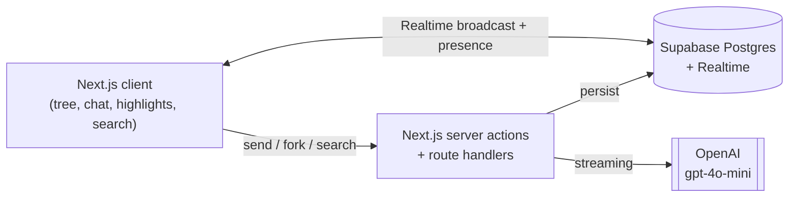
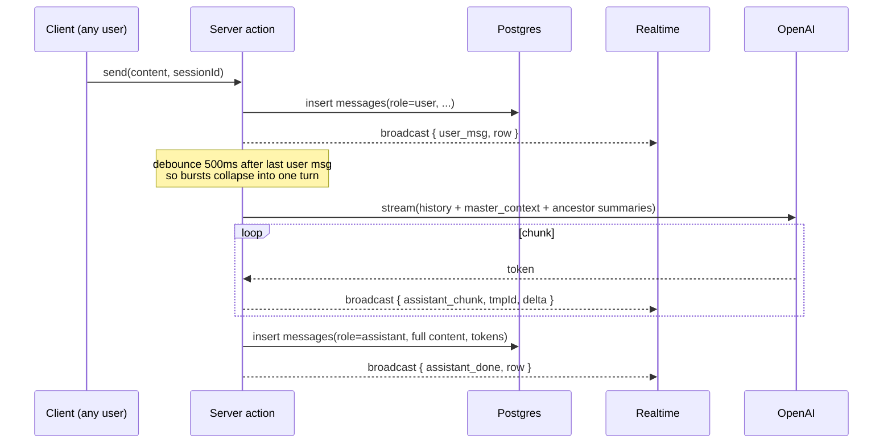

# AGENTS.md

Onboarding context for anyone (human or AI agent) writing code in this repo.
Move this file to the repo root once the Next.js project is bootstrapped.

## What we're building

A multiplayer ChatGPT-style workspace. Groups join a "project" with a 6-character room code, share live LLM chat sessions, fork sessions to explore alternative threads, pin highlights to a shared backboard, and run a stateless cross-session AI search.

The visual hook: behind the active chat is a **fork tree** showing every session in the project. Click a node to open that session over the tree; click empty space to zoom out.

## Goals & non-goals

**Goal:** ship an MVP that demos cleanly. Finishing beats polish. If a feature works end-to-end on the happy path, move on.

**MVP scope (everything below must work):**

1. Create a project, get a 6-char room code, share it.
2. Anyone joins by code, picks a display name, lands in a session.
3. Editable master prompt at the top of the page, live-synced.
4. Per-user chat input; multiple users can send messages into the same shared chat. The assistant replies once per burst.
5. Fork from any message → child session that copies messages 1..N.
6. Background fork-tree view; click to open a session over it.
7. Highlight a snippet from a message → it appears on a shared backboard for the project. Click highlight → scroll to source.
8. Stateless project-wide search panel that answers natural-language questions citing session IDs.

**Explicitly out of scope:**

- Auth, accounts, password resets, rate limiting.
- Mobile layout. Target a laptop screen.
- True collaborative text editing (CRDTs / Yjs / OT). Not needed anywhere.
- Multi-parent "merge" sessions (DAG). Single-parent fork only.
- Embeddings / vector search. Summary stuffing is enough.
- Token counting / cost dashboards. We use `gpt-4o-mini` with a 128k window and stay well under it via simple caps (see *LLM prompt rules*).

## Tech stack (locked)

- **Next.js 15** (App Router) + **TypeScript**
- **Tailwind** + **shadcn/ui**
- **Supabase** — Postgres + Realtime + anon JS client
- **Vercel AI SDK** (`ai`, `@ai-sdk/openai`) for streaming + `useChat`
- **OpenAI `gpt-4o-mini`** for chat, summaries, search
- **React Flow** + **dagre** for the fork tree
- **Vercel** for deploy

Do not introduce: Yjs, Liveblocks, Convex, a custom WebSocket server, a separate ORM, a state-management library beyond React state + SWR. If you find yourself wanting them, the design has gone wrong.

## Folder layout

```
app/
  page.tsx               # landing: create or join by code
  (room)/[code]/         # main collab UI for a project
    layout.tsx           # top bar + 2/3 left + 1/3 right shell
    chat/                # message list, per-user input, streaming
    tree/                # React Flow fork tree background
    highlights/          # backboard panel
    search/              # stateless search panel
  api/
    users/upsert/        # POST { clientId, displayName, color }
    summarize/           # POST { sessionId } → updates sessions.summary
    search/              # POST { projectId, query } → cited answer
components/              # shared UI
lib/
  supabase/              # browser + server clients
  llm/                   # OpenAI wrappers, prompt builders
  realtime/              # channel helpers, presence helpers
  tree/                  # dagre layout helpers
  identity.ts            # clientId + displayName from localStorage
db/migrations/           # SQL files
types/                   # shared TS types mirroring DB
```

## Environment

```
NEXT_PUBLIC_SUPABASE_URL=
NEXT_PUBLIC_SUPABASE_ANON_KEY=
SUPABASE_SERVICE_ROLE_KEY=     # server-only, used in route handlers
OPENAI_API_KEY=
```

Never commit `.env.local`. RLS is **disabled** for the hackathon — the anon key is effectively god-mode and we accept that.

## Architecture



Every persistent thing lives in Postgres. Realtime is the *fast path* for fan-out. The DB is the source of truth; broadcast events are eventually-consistent hints.

## Identity (no auth)

1. On first load, generate `clientId = crypto.randomUUID()` and persist `{ clientId, displayName, color }` in `localStorage`.
2. `POST /api/users/upsert` upserts a `users` row keyed by `clientId`.
3. Every server action reads `clientId` from a request header and uses it for `created_by` / `author_id`.
4. Anyone with a `clientId` can claim to be anyone. Acceptable for an MVP demo.

Display-name collisions are resolved in the UI by appending the first 4 chars of `clientId` (`Alice#a1b2`). Never make `display_name` unique in the DB.

## Realtime model

Two channels per project:

- `project:{projectId}` — broadcast: master context edits, new sessions created, new highlights, session metadata bumps.
- `session:{sessionId}` — broadcast: new messages, assistant streaming chunks; presence: who is currently viewing.

**Chat is append-only.** Multiple users typing simultaneously is fine — each one has their own input box, each `send` writes its own `messages` row. There is no shared draft, no co-edited input, no CRDT anywhere in the system.

**Master prompt sync** (the one shared textarea): on every keystroke, debounce 300ms, then `UPDATE projects SET master_context = ?` and broadcast on `project:{id}`. Receiving clients overwrite their textarea **only if it isn't currently focused locally** — never stomp the active typist. Two users focused and typing simultaneously can lose a few chars; that's acceptable.

### How a chat turn flows



While a stream is in flight, lock everyone's input on that session. Unlock on `assistant_done`.

## LLM prompt rules

- **Chat turn input** = `[system: master_context]` + `[system: ancestor-chain summaries]` + `[last 30 messages of the current session]`.
  - **Only the parent chain.** Walk `parent_session_id` upward from the current session to the root and inject those `sessions.summary` rows. **Sibling, cousin, and otherwise-unrelated sessions are not injected** — they're invisible to the chat turn. (Search, below, is the path that sees every session.)
  - **Cap at the 5 closest ancestors.** If the chain is deeper than 5, keep the 5 nearest (closest to current) and drop the oldest roots.
  - **Order: root-most first**, then walk down to the immediate parent, then current-session messages. The model reads the context like a story leading into the live conversation.
  - No tiktoken counter — `gpt-4o-mini`'s 128k window has huge headroom under `master_context` (≤ ~2k tokens) + 5 × 200-token ancestor summaries + 30 recent messages.
- **Burst coalescing**: server waits 500ms after the last user-message insert in a session before issuing a single assistant turn that sees all of them.
- **Summary regeneration** = on fork, and whenever a session's `message_count` crosses a multiple of 10. Server action loads all messages, asks the model to summarize in ≤ 200 tokens, writes to `sessions.summary`.
- **Search** = single stateless call. **System prompt contains every session's `id`, `label`, and `summary` for the project** — this is the *only* place we go cross-tree. User message is the query. Instruct the model to cite session IDs in `[[<id>]]` form. The UI parses citations and links them to the tree.
- **Auto-highlights (stretch only)** = ask the model to optionally emit `proposeHighlight({ message_id, snippet, reason })`. Insert with `source='ai'`.

## Data model (source of truth — keep `db/migrations/` in sync)

| Table | Purpose |
| --- | --- |
| `users` | Anonymous participants, keyed by client-generated UUID. |
| `projects` | A "room" with a join code + master context. |
| `sessions` | One conversation thread; can have a parent session. |
| `session_participants` | Who has ever opened a session (history, not live presence). |
| `messages` | Append-only chat content. |
| `highlights` | Pinned snippets; link back to source message. |

### Initial migration

```sql
create extension if not exists "pgcrypto";

create table users (
  id uuid primary key,
  display_name text not null,
  color text not null,
  created_at timestamptz not null default now(),
  last_seen_at timestamptz not null default now()
);

create table projects (
  id uuid primary key default gen_random_uuid(),
  name text not null,
  room_code text not null unique,
  master_context text not null default '',
  created_by uuid references users(id),
  created_at timestamptz not null default now(),
  updated_at timestamptz not null default now()
);
create index on projects (room_code);

create table sessions (
  id uuid primary key default gen_random_uuid(),
  project_id uuid not null references projects(id) on delete cascade,
  parent_session_id uuid references sessions(id) on delete set null,
  fork_point_message_id uuid,
  label text,
  tags text[] not null default '{}',
  summary text not null default '',
  created_by uuid references users(id),
  created_at timestamptz not null default now(),
  updated_at timestamptz not null default now(),
  last_activity_at timestamptz not null default now(),
  message_count int not null default 0,
  is_archived boolean not null default false
);
create index on sessions (project_id, parent_session_id);

create table messages (
  id uuid primary key default gen_random_uuid(),
  session_id uuid not null references sessions(id) on delete cascade,
  role text not null check (role in ('user','assistant','system')),
  author_id uuid references users(id),
  content text not null,
  model text,
  prompt_tokens int,
  completion_tokens int,
  created_at timestamptz not null default now(),
  edited_at timestamptz,
  is_deleted boolean not null default false
);
create index on messages (session_id, created_at);

alter table sessions
  add constraint sessions_fork_point_fk
  foreign key (fork_point_message_id) references messages(id) on delete set null;

create table session_participants (
  session_id uuid not null references sessions(id) on delete cascade,
  user_id uuid not null references users(id) on delete cascade,
  joined_at timestamptz not null default now(),
  last_active_at timestamptz not null default now(),
  message_count int not null default 0,
  primary key (session_id, user_id)
);
create index on session_participants (user_id);

create table highlights (
  id uuid primary key default gen_random_uuid(),
  session_id uuid not null references sessions(id) on delete cascade,
  message_id uuid references messages(id) on delete set null,
  content text not null,
  note text,
  source text not null check (source in ('user','ai')),
  created_by uuid references users(id),
  created_at timestamptz not null default now()
);
create index on highlights (session_id, created_at);
```

## Forking semantics

- Fork = copy. When a user forks from `messageId` of session A, insert a new `sessions` row with `parent_session_id = A.id` and `fork_point_message_id = messageId`, then copy messages 1..N from A into the new session as fresh rows.
- Cheap, simple, makes the tree easy to render. The duplication cost is fine for an MVP.
- Multi-parent merges are out of scope. Don't add a `session_parents` join table.

## Conventions

- Branch off `main`; squash-merge PRs even if review is fast. `main` is always demo-ready.
- Commits are present-tense imperative: `feat: streaming chat`, `fix: tree layout overflow`.
- Schema changes ship in the same PR as the matching `types/` and `db/migrations/` updates.
- New deps need a one-line justification in the PR description.
- Reach for the cheap solution. If a piece of work expands past ~30 min of unexpected scope, simplify or cut it.

## Don't-forget list

- Always pass the `clientId` header on writes; otherwise `created_by` will be NULL and the UI looks broken.
- Lock all chat inputs in a session while an assistant stream is in flight. Unlock on `assistant_done`.
- Re-summarize a session on fork and every 10 new messages — search quality depends on it.
- Ship a fallback "session list sidebar" behind a `?tree=off` URL flag in case React Flow misbehaves late in the build. Build the flag in hour 1.
- Bump `sessions.last_activity_at` and increment `sessions.message_count` on every message insert (do it in the same server action as the insert).

## For AI coding agents

- Read this file before changes. It is the single source of truth for stack, schema, and scope.
- Mirror schema changes in `types/` and `db/migrations/` in the same commit.
- Do not add: Yjs, Liveblocks, Convex, a custom WebSocket server, a state library beyond React + SWR, a separate ORM, auth.
- Do not "improve" the design beyond MVP. Out-of-scope features stay out.
- Prefer the smallest implementation that satisfies the MVP feature description above.
- When two designs are both valid, pick the one that ships in under 30 minutes.

