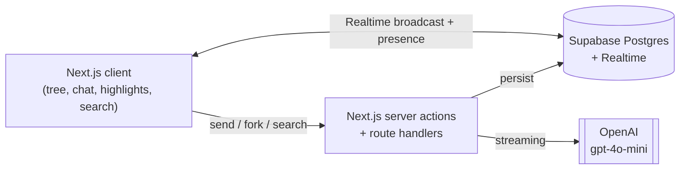
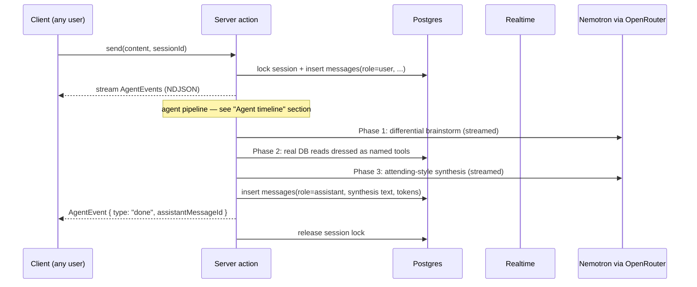

# AGENTS.md

Onboarding context for anyone (human or AI agent) writing code in this repo.
Move this file to the repo root once the Next.js project is bootstrapped.

## What we're building

A multiplayer ChatGPT-style workspace. Groups join a "project" with a 6-character room code, share live LLM chat sessions, fork sessions to explore alternative threads, pin highlights to a shared backboard, and run a stateless cross-session AI search.

The visual hook: behind the active chat is a **fork tree** showing every session in the project. Click a node to open that session over the tree; click empty space to zoom out.

## Goals & non-goals

**Goal:** ship an MVP that demos cleanly. Finishing beats polish. If a feature works end-to-end on the happy path, move on.

**MVP scope (everything below must work):**

1. Create a project, get a 6-char room code, share it.
2. Anyone joins by code, picks a display name, lands in a session.
3. Editable master prompt at the top of the page, live-synced.
4. Per-user chat input; multiple users can send messages into the same shared chat. The assistant replies once per burst.
5. Fork from any message → child session that copies messages 1..N.
6. Background fork-tree view; click to open a session over it.
7. Highlight a snippet from a message → it appears on a shared backboard for the project. Click highlight → scroll to source.
8. Stateless project-wide search panel that answers natural-language questions citing session IDs.

**Explicitly out of scope:**

- Auth, accounts, password resets, rate limiting.
- Mobile layout. Target a laptop screen.
- True collaborative text editing (CRDTs / Yjs / OT). Not needed anywhere.
- Multi-parent "merge" sessions (DAG). Single-parent fork only.
- Embeddings / vector search. Summary stuffing is enough.
- Token counting / cost dashboards. We use `gpt-4o-mini` with a 128k window and stay well under it via simple caps (see *LLM prompt rules*).

## Tech stack (locked)

- **Next.js 15** (App Router) + **TypeScript**
- **Tailwind** + **shadcn/ui**
- **Supabase** — Postgres + Realtime + anon JS client
- **Vercel AI SDK** (`ai`, `@ai-sdk/openai`) for streaming + `useChat`
- **NVIDIA Nemotron via OpenRouter** (default `nvidia/nemotron-nano-9b-v2:free`,
  override with `OPENROUTER_CHAT_MODEL`) for chat, summaries, search, and the
  agent timeline
- **React Flow** + **dagre** for the fork tree
- **Vercel** for deploy

Do not introduce: Yjs, Liveblocks, Convex, a custom WebSocket server, a separate ORM, a state-management library beyond React state + SWR. If you find yourself wanting them, the design has gone wrong.

## Folder layout

```
app/
  page.tsx               # landing: create or join by code
  (room)/[code]/         # main collab UI for a project
    layout.tsx           # top bar + 2/3 left + 1/3 right shell
    chat/                # fallback sidebar chat (used with ?tree=off)
    forest/              # main fork-tree canvas + chat overlay
    right/               # search-on-top, highlights-below right panel
    highlights/          # backboard panel
    search/              # legacy stateless search panel (kept for ?tree=off)
  api/
    users/upsert/        # POST { clientId, displayName, color }
    summarize/           # POST { sessionId } → updates sessions.summary
    search/              # POST { projectId, query } → streams AgentEvents
    sessions/[id]/messages # POST → streams AgentEvents (chat agent timeline)
components/              # shared UI
  chat/AgenticTimeline   # visible "clinical team" agent run (chat + search)
lib/
  supabase/              # browser + server clients
  llm/                   # OpenRouter wrapper, prompt builders, agent pipeline
    agent-events.ts      # NDJSON wire protocol shared by chat + search
    agent-pipeline.ts    # server-side orchestrator (differential → evidence → synthesis)
    agent-timeline-state.ts # client-side reducer that drives the timeline UI
  realtime/              # channel helpers, presence helpers
  tree/                  # dagre layout helpers
  identity.ts            # clientId + displayName from localStorage
db/migrations/           # SQL files
types/                   # shared TS types mirroring DB
```

## Environment

```
NEXT_PUBLIC_SUPABASE_URL=
NEXT_PUBLIC_SUPABASE_ANON_KEY=
SUPABASE_SERVICE_ROLE_KEY=     # server-only, used in route handlers
OPENROUTER_API_KEY=            # required for chat, summaries, search, agent timeline
OPENROUTER_CHAT_MODEL=         # optional; defaults to nvidia/nemotron-nano-9b-v2:free
OPENAI_API_KEY=                # legacy; only used by /api/summarize fallback paths
```

Never commit `.env.local`. RLS is **disabled** for the hackathon — the anon key is effectively god-mode and we accept that.

## Architecture



Every persistent thing lives in Postgres. Realtime is the *fast path* for fan-out. The DB is the source of truth; broadcast events are eventually-consistent hints.

## Identity (no auth)

1. On first load, generate `clientId = crypto.randomUUID()` and persist `{ clientId, displayName, color }` in `localStorage`.
2. `POST /api/users/upsert` upserts a `users` row keyed by `clientId`.
3. Every server action reads `clientId` from a request header and uses it for `created_by` / `author_id`.
4. Anyone with a `clientId` can claim to be anyone. Acceptable for an MVP demo.

Display-name collisions are resolved in the UI by appending the first 4 chars of `clientId` (`Alice#a1b2`). Never make `display_name` unique in the DB.

## Realtime model

Two channels per project:

- `project:{projectId}` — broadcast: master context edits, new sessions created, new highlights, session metadata bumps.
- `session:{sessionId}` — broadcast: new messages, assistant streaming chunks; presence: who is currently viewing.

**Chat is append-only.** Multiple users typing simultaneously is fine — each one has their own input box, each `send` writes its own `messages` row. There is no shared draft, no co-edited input, no CRDT anywhere in the system.

**Master prompt sync** (the one shared textarea): on every keystroke, debounce 300ms, then `UPDATE projects SET master_context = ?` and broadcast on `project:{id}`. Receiving clients overwrite their textarea **only if it isn't currently focused locally** — never stomp the active typist. Two users focused and typing simultaneously can lose a few chars; that's acceptable.

### How a chat turn flows



While a stream is in flight, lock everyone's input on that session. Unlock when the agent emits `done` (also unlocked on client abort).

## Agent timeline (the "clinical team" synthesis path)

Every model-driven response in the app — chat replies and project-wide
search — runs through one agent pipeline that streams a visible timeline
to the client. This is the project's NVIDIA Nemotron showcase: the model
plans its own work, calls named tools, and only then produces the final
answer. The user sees each step happen.

The pipeline is **always three phases** rendered with clinical-team labels:

| Phase ID | Label | What it does |
| --- | --- | --- |
| `differential` | **Differential brainstorming** | One Nemotron call. Short scratchpad: 2–4 plausible interpretations, the largest open uncertainty, and a one-line `Plan:` describing what to fetch. Streamed to the UI; never persisted. |
| `evidence` | **Evidence retrieval** | Real Supabase reads dressed as named "tools" (`fetch_session_digests`, `read_recent_messages`, `pull_pinned_highlights`). Each tool emits a `tool_call` followed by a `tool_result` with a one-line log (`"Read session [[id]]: last 15 messages"`). |
| `synthesis` | **Attending-style synthesis** | Second Nemotron call. System prompt = the original chat system prompt + the brainstorm scratchpad + the evidence pack. Streamed tokens become the persisted assistant message. Cites sessions with `[[<session_id>]]`. |

Even though the tools are real DB reads, we present them as a workup so
that the experience feels like a multi-step agent rather than a single
prompt. Repetition is fine — the same evidence pack is gathered each
turn. Simplicity beats cleverness here; the visual story is the value.

### Wire format

`lib/llm/agent-events.ts` owns the type. Both endpoints stream NDJSON
(one `AgentEvent` per line) over a `text/plain` body so existing fetch
infra and proxies just work.

```ts
type AgentEvent =
  | { type: "phase";        phase: AgentPhaseId; label: string }
  | { type: "phase_status"; phase: AgentPhaseId; status: "done" }
  | { type: "delta";        phase: AgentPhaseId; text: string }
  | { type: "tool_call";    name: string; label: string; args?: string }
  | { type: "tool_result";  name: string; log: string; sessionIds?: string[] }
  | { type: "error";        message: string }
  | { type: "done";         assistantMessageId: string | null };
```

`AgentPhaseId` is `"differential" | "evidence" | "synthesis"`. Clients
parse the stream with `takeCompleteLines` from the same module.

### Persistence

The chat agent run is **not** ephemeral. As the route emits each
`AgentEvent` it also tees the event into an in-memory log; when the
synthesis lands, the route folds the log through the same reducer the
client uses, serializes the resulting state, and writes it into
`messages.agent_trace` (jsonb) alongside the assistant row. After a
refresh, every saved assistant message renders with a collapsed
"▾ Show reasoning trace" disclosure that re-hydrates the timeline.

Search traces are intentionally **not** persisted — search is stateless,
the only output is the streamed answer, and there's no row to attach a
trace to.

The reducer + serialize/deserialize/safeParse helpers live in pure
`lib/llm/agent-trace.ts` (no React) so the route can use them. The
client hook `useAgentTimeline()` in `lib/llm/agent-timeline-state.ts`
just wraps the reducer in `useReducer`.

### Visible UI

`<AgenticTimeline state={...} />` (in `components/chat/`) renders the
timeline. It's used in three places — keep them in sync:

1. `app/(room)/[code]/forest/NodeOverlay.tsx` — chat overlay over the
   fork tree (the main surface).
2. `app/(room)/[code]/chat/ChatPanel.tsx` — sidebar fallback when
   `?tree=off` is set.
3. `app/(room)/[code]/right/RightPanel.tsx` — search results card on
   the right side of the room.

For **saved** assistant messages, render
`<PersistedAgentTrace trace={message.agent_trace} />` directly under the
bubble — it's a self-contained collapsible disclosure that no-ops when
the column is null.

The hook that wires events into renderable state is
`useAgentTimeline()` from `lib/llm/agent-timeline-state.ts`. Pass its
`apply` callback as the `onAgentEvent` option on `sendMessage()` /
`searchProject()`.

### When extending

- Adding a new "tool" only requires emitting `tool_call` + `tool_result`
  inside `runEvidenceRetrieval` — the UI renders any number of steps.
- Adding a fourth phase requires adding a new `AgentPhaseId` value and a
  matching label/icon/tint in `<AgenticTimeline />`. Don't introduce
  ad-hoc protocol fields; if the timeline can't show it, don't emit it.
- Don't switch protocols (SSE, WebSockets, gRPC, etc.). NDJSON over
  `fetch` keeps the surface area trivial.

## LLM prompt rules

The chat path is **agentic** (see "Agent timeline" above). The numbers
below describe the inputs to the **synthesis** phase — the only phase
whose output gets persisted into `messages`. The differential phase
sees the same recent-message history but with a different system prompt
that tells it to brainstorm rather than answer.

- **Chat synthesis input** = `[system: master_context]` + `[system: smart_context]` + `[system: brainstorm scratchpad]` + `[system: evidence pack]` + `[last 30 messages of the current session]`.
  - **`smart_context`** is the per-branch ancestor distillation populated when the session is forked / combined (see `lib/llm/smart-context.ts`). It supersedes the older "walk parent_session_id and stuff summaries" rule.
  - **Evidence pack** is gathered live each turn by the agent pipeline (sibling session digests, recent transcripts from a few priority sessions, pinned highlights). This is what gives the assistant cross-session awareness without putting the entire workspace in every prompt.
  - **No tiktoken counter** — Nemotron's window has huge headroom under master_context (≤ ~2k tokens) + smart_context (≤ ~6k chars) + a small evidence pack + 30 recent messages.
- **Burst coalescing** is *not* implemented today (the lock serializes turns instead — only one user can have an in-flight reply per session). Acceptable for the MVP.
- **Summary regeneration** = on fork, and whenever a session's `message_count` crosses a multiple of 10. Server action loads all messages, asks the model to summarize in ≤ 200 tokens, writes to `sessions.summary`.
- **Search** uses the same agent pipeline as chat — `runSearchPipeline` in `lib/llm/agent-pipeline.ts`. Phase 1 brainstorms over the query, phase 2 pulls evidence (sibling digests + recent transcripts + highlights), phase 3 synthesizes the final cited answer. **Search is the only place that goes truly cross-tree by default**, but chat now also touches sibling sessions via the evidence phase.
- **Cite session IDs in `[[<id>]]` form.** The timeline component renders these as clickable chips that open the cited session.
- **Auto-highlights (stretch only)** = ask the model to optionally emit `proposeHighlight({ message_id, snippet, reason })`. Insert with `source='ai'`.

## Data model (source of truth — keep `db/migrations/` in sync)

| Table | Purpose |
| --- | --- |
| `users` | Anonymous participants, keyed by client-generated UUID. |
| `projects` | A "room" with a join code + master context. |
| `sessions` | One conversation thread; can have a parent session. |
| `session_participants` | Who has ever opened a session (history, not live presence). |
| `messages` | Append-only chat content. |
| `highlights` | Pinned snippets; link back to source message. |

### Initial migration

```sql
create extension if not exists "pgcrypto";

create table users (
  id uuid primary key,
  display_name text not null,
  color text not null,
  created_at timestamptz not null default now(),
  last_seen_at timestamptz not null default now()
);

create table projects (
  id uuid primary key default gen_random_uuid(),
  name text not null,
  room_code text not null unique,
  master_context text not null default '',
  created_by uuid references users(id),
  created_at timestamptz not null default now(),
  updated_at timestamptz not null default now()
);
create index on projects (room_code);

create table sessions (
  id uuid primary key default gen_random_uuid(),
  project_id uuid not null references projects(id) on delete cascade,
  parent_session_id uuid references sessions(id) on delete set null,
  fork_point_message_id uuid,
  session_target text not null,
  label text,
  tags text[] not null default '{}',
  summary text not null default '',
  created_by uuid references users(id),
  created_at timestamptz not null default now(),
  updated_at timestamptz not null default now(),
  last_activity_at timestamptz not null default now(),
  message_count int not null default 0,
  is_archived boolean not null default false
);
create index on sessions (project_id, parent_session_id);

create table messages (
  id uuid primary key default gen_random_uuid(),
  session_id uuid not null references sessions(id) on delete cascade,
  role text not null check (role in ('user','assistant','system')),
  author_id uuid references users(id),
  content text not null,
  model text,
  prompt_tokens int,
  completion_tokens int,
  created_at timestamptz not null default now(),
  edited_at timestamptz,
  is_deleted boolean not null default false,
  -- migration 0007_message_agent_trace.sql:
  -- snapshot of the visible "clinical team" run (Differential brainstorming →
  -- Evidence retrieval → Attending synthesis) that produced this message.
  -- Shape mirrors `PersistedAgentTrace` from `lib/llm/agent-trace.ts`.
  -- Rendered as a "▾ Show reasoning trace" disclosure under the bubble.
  agent_trace jsonb
);
create index on messages (session_id, created_at);

alter table sessions
  add constraint sessions_fork_point_fk
  foreign key (fork_point_message_id) references messages(id) on delete set null;

create table session_participants (
  session_id uuid not null references sessions(id) on delete cascade,
  user_id uuid not null references users(id) on delete cascade,
  joined_at timestamptz not null default now(),
  last_active_at timestamptz not null default now(),
  message_count int not null default 0,
  primary key (session_id, user_id)
);
create index on session_participants (user_id);

create table highlights (
  id uuid primary key default gen_random_uuid(),
  session_id uuid not null references sessions(id) on delete cascade,
  message_id uuid references messages(id) on delete set null,
  content text not null,
  note text,
  source text not null check (source in ('user','ai')),
  created_by uuid references users(id),
  created_at timestamptz not null default now()
);
create index on highlights (session_id, created_at);
```

## Forking semantics

- Fork = copy. When a user forks from `messageId` of session A, insert a new `sessions` row with `parent_session_id = A.id` and `fork_point_message_id = messageId`, then copy messages 1..N from A into the new session as fresh rows.
- Every new session must have an explicit `session_target` authored by the user before the session starts (e.g. "Find root cause of timeout in payments").
- Cheap, simple, makes the tree easy to render. The duplication cost is fine for an MVP.
- Multi-parent merges are out of scope. Don't add a `session_parents` join table.

## Conventions

- Branch off `main`; squash-merge PRs even if review is fast. `main` is always demo-ready.
- Commits are present-tense imperative: `feat: streaming chat`, `fix: tree layout overflow`.
- Schema changes ship in the same PR as the matching `types/` and `db/migrations/` updates.
- New deps need a one-line justification in the PR description.
- Reach for the cheap solution. If a piece of work expands past ~30 min of unexpected scope, simplify or cut it.

## Don't-forget list

- Always pass the `clientId` header on writes; otherwise `created_by` will be NULL and the UI looks broken.
- Lock all chat inputs in a session while an assistant stream is in flight. Unlock when the agent emits `done` (or on client abort — `req.signal` is wired into the route).
- Re-summarize a session on fork and every 10 new messages — search quality depends on it.
- Require a non-empty `sessions.session_target` whenever creating a session (root or forked). Search quality depends on this.
- Ship a fallback "session list sidebar" behind a `?tree=off` URL flag in case React Flow misbehaves late in the build. Build the flag in hour 1.
- Bump `sessions.last_activity_at` and increment `sessions.message_count` on every message insert (do it in the same server action as the insert).
- The chat + search routes both stream NDJSON `AgentEvent`s. If you change the protocol, update **all four** consumers in lockstep: `lib/llm/agent-events.ts`, the two API routes, and the reducer in `lib/llm/agent-trace.ts` (the React hook just wraps it).
- When you change the persisted shape (`PersistedAgentTrace`), bump `version` and teach `safeParseTrace` to either migrate or reject older rows. Saved traces don't get backfilled.

## For AI coding agents

- Read this file before changes. It is the single source of truth for stack, schema, and scope.
- Mirror schema changes in `types/` and `db/migrations/` in the same commit.
- Do not add: Yjs, Liveblocks, Convex, a custom WebSocket server, a state library beyond React + SWR, a separate ORM, auth.
- Do not "improve" the design beyond MVP. Out-of-scope features stay out.
- Prefer the smallest implementation that satisfies the MVP feature description above.
- When two designs are both valid, pick the one that ships in under 30 minutes.
- The agent timeline is the project's NVIDIA Nemotron showcase. Don't quietly skip a phase or stop streaming `tool_call`/`tool_result` events to "save time" — the visible run is the deliverable. Even if the underlying tool is a one-line DB read, emit it so the user sees the agent doing its workup.
- If you add new "tools" to evidence retrieval, name them like a clinical workflow (`fetch_session_digests`, `read_recent_messages`, `pull_pinned_highlights`, `cross_reference_highlights`, …). The "fake-named-but-real-underneath" framing is intentional.

